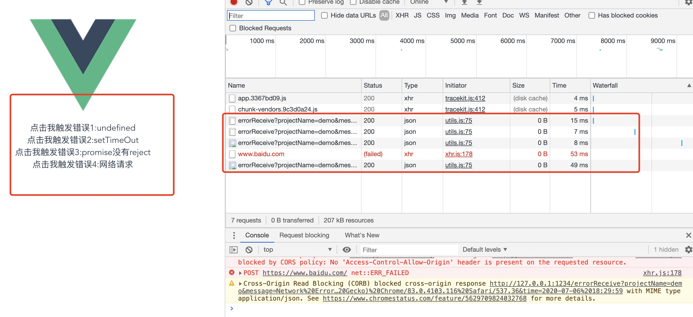

# 三个文件夹介绍
# service 
启动用来接收错误的

# vue-demo
前端页面demo

# vue-error-notify
捕获错误的sdk


# 怎么跑起来

# 1.本地link
```
cd ./vue-error-notify
npm link
```
# 2. demolink
```
cd ./vue-demo
npm install
npm link vue-error-notify
```
# 3. demo打包
## 极大概率第一次打包报错，eslint相关的错误
## 不要管，再打一次，应该就正常了
```
npm run build
```
# 4.把vue-demo/dist/js/ *.map文件复制到./service/maps文件夹下
# 5.分别运行两个项目
```
cd ./service
npm install
node index.js
```
```
cd ./vue-demo/dist
npx http-server
```
# 5.打开http://127.0.0.1:8081
F12，侧边栏打开网络请求
依次点击左边的按钮

